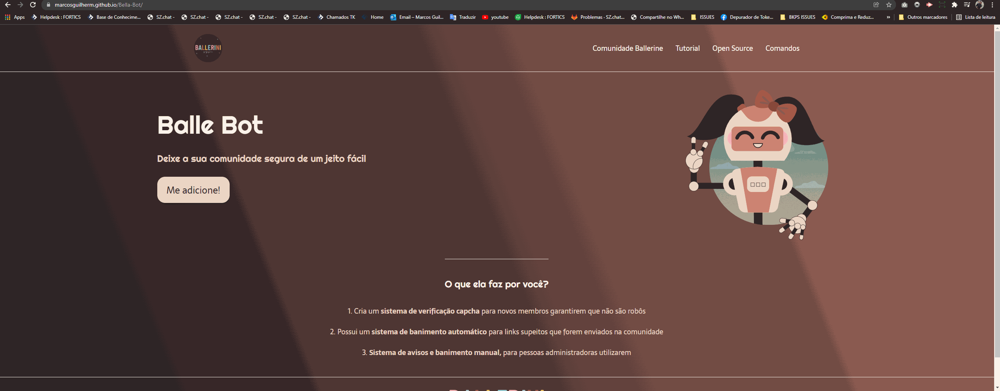

<h1 align="center">
  Landing Page Balle-Bot
</h1>

<h3 align="center">
  Este é um projeto simples, onde foi criado uma landing page da Balle-Bot
</h3>

  

## 🚀 Tecnologias

Esse projeto foi desenvolvido com as seguintes tecnologias:

- HTML
- CSS

## 💻 Projeto

E uma landing page criada da Balle Bot, da comunidade da Ballerine.

Veja o projeto funcionando através [desse link](https://marcosguilherm.github.io/Balle-Bot/)

## 🔖 Layout

Você pode visualizar o layout do projeto através [desse link](<https://www.figma.com/file/myqP66iQwzjwjrIAJyyrip/BalleBot?node-id=0%3A1>). É necessário ter conta no [Figma](https://figma.com) para acessá-lo.
